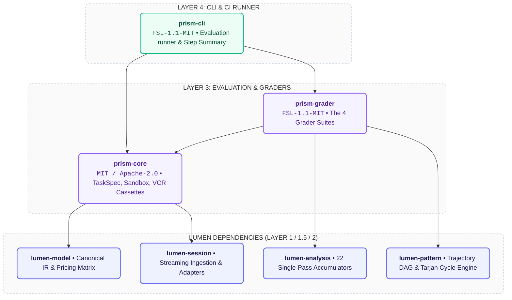
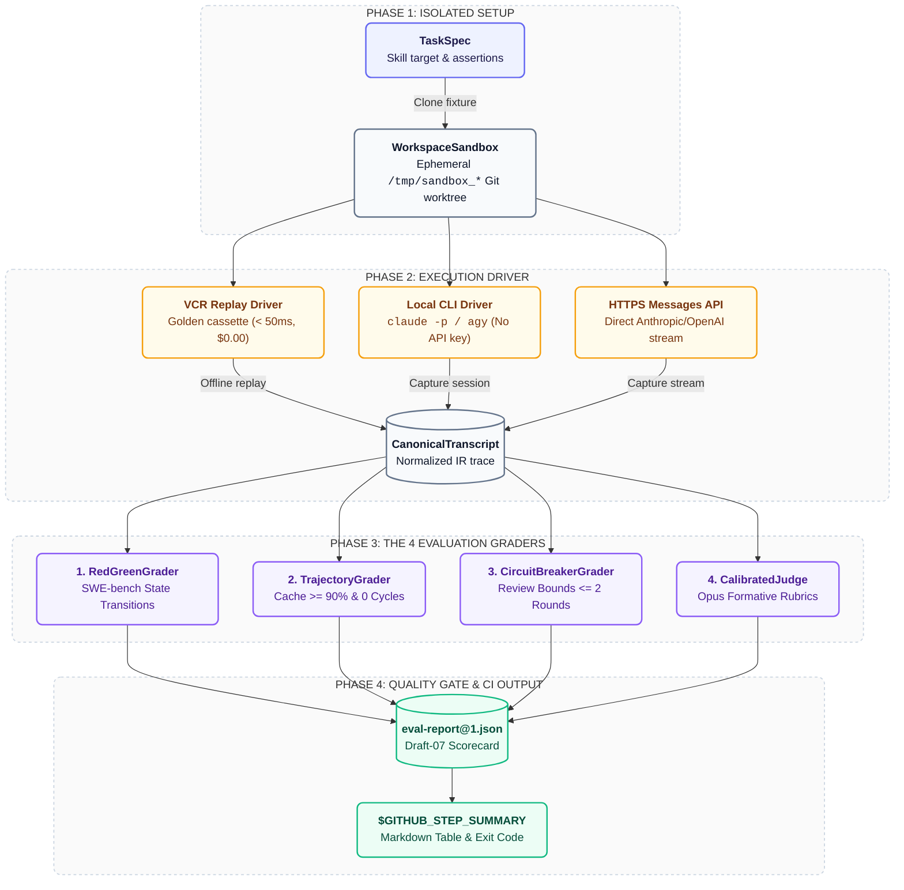

# Prism Architecture (`ARCHITECTURE.md`)

This document defines the crate architecture, evaluation pipeline, grader engines, and execution drivers of Prism.

---

## 1. Crate Hierarchy & Dependencies

---

## 2. Evaluation Dataflow Pipeline

---

## 3. The 4 Decoupled Grader Engines

1. **Deterministic State Grader (`RedGreenGrader`)**: Verifies that the codebase was in a failing state before the agent's changes (Red Pass) and transitions to passing with zero regressions (Green Pass).
2. **Trajectory & Pattern Grader (`TrajectoryGrader`)**: Evaluates token economics to guarantee high prompt cache hit ratios ($\ge 90\%$) and zero redundant search cycles.
3. **Multi-Agent Circuit Grader (`CircuitBreakerGrader`)**: Monitors interaction between agent roles (e.g. Drafter ↔ Auditor) and trips if consensus is not reached within 2 rounds.
4. **Calibrated Rubric Judge (`CalibratedJudge`)**: Uses contrastive few-shot anchors to evaluate qualitative code and design requirements without non-deterministic drift.
