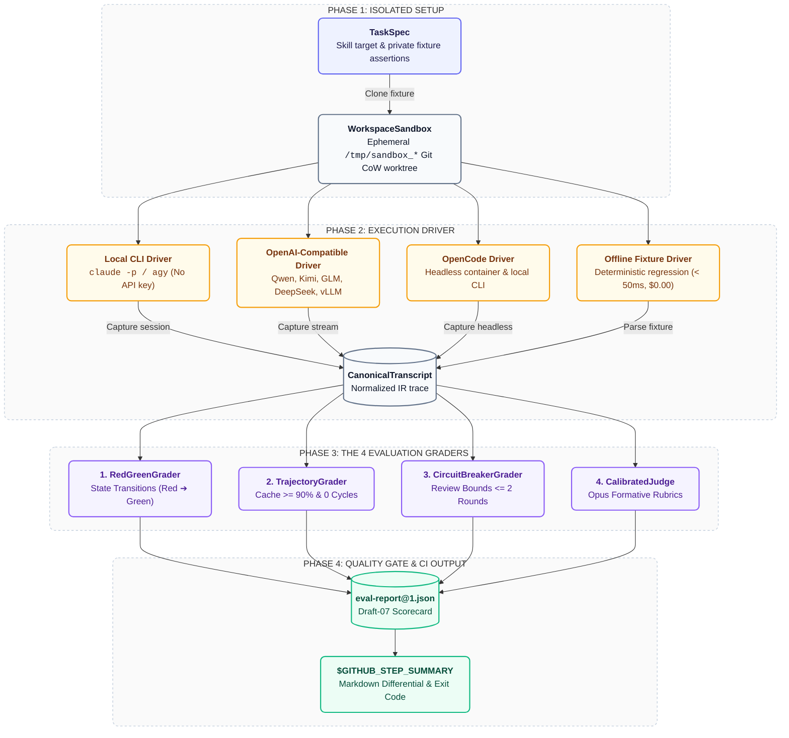
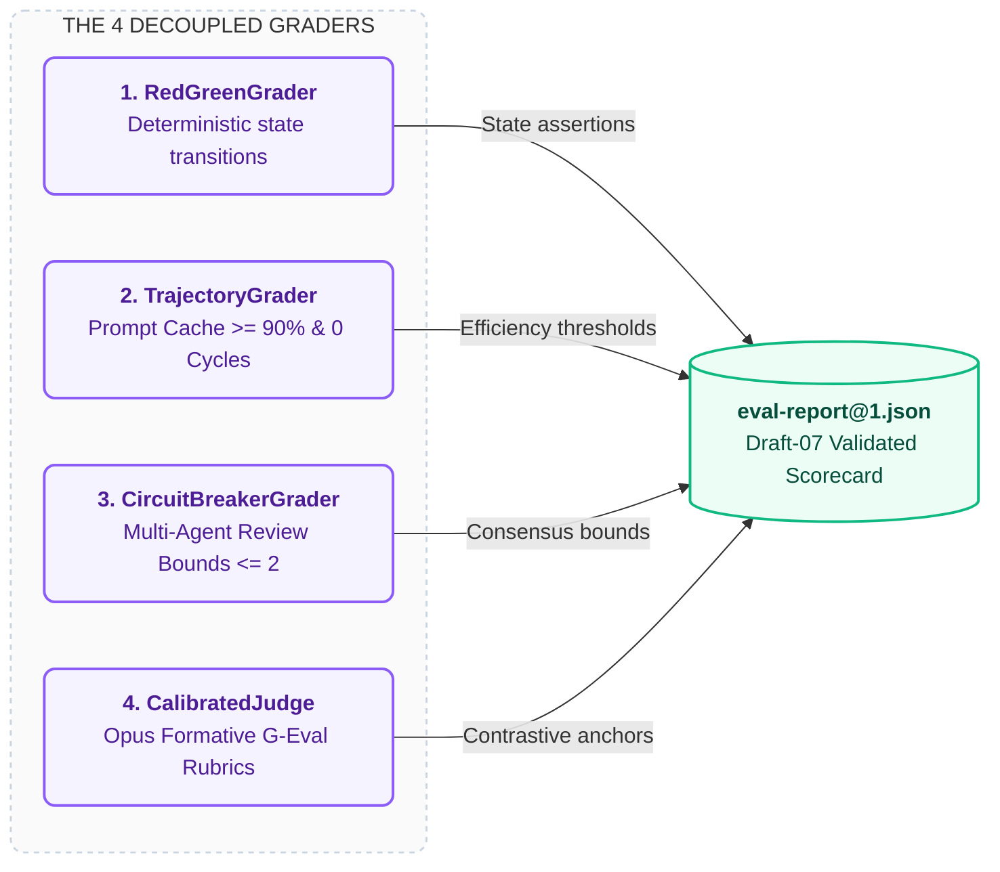

<div align="center">

# Prism

**Evaluation runner and CI quality-gating platform for AI coding agents and plugins.**

[](https://github.com/orin-axi/prism/actions)
[](https://functional-source-license.com/1.1/)
[](https://www.rust-lang.org)
[](https://github.com/orin-axi/prism)

[Overview](#overview) • [Pipeline](#evaluation-pipeline) • [The 8 Evaluated Dimensions](#the-8-evaluated-dimensions) • [The 4 Graders](#the-4-graders) • [Installation](#installation) • [CLI Reference](#cli-reference) • [Matrix Experiments](#declarative-matrix-experiments) • [CI Integration](#github-actions-ci-integration)

</div>

---

## Overview

Testing AI coding agents, skills, and prompts in continuous integration requires fast execution, empirical data-vs-data comparisons, and deterministic gating.

**Prism** is a developer-first evaluation and regression runner written in safe Rust. Built specifically for teams developing custom agent plugins (such as `orin-dx/agent-plugins`), prompts, and internal developer tooling, Prism allows engineers to:
1. **Verify Prompt & Skill Improvements**: Run controlled A/B evaluations on the exact same model to prove that a prompt change improved pass rates and reduced turns without anecdotal guessing.
2. **Empirically Test Model Offloading**: Compare whether cheaper models (e.g. Gemini 2.0 Flash, Qwen 2.5 Coder 32B, DeepSeek R1) can execute specific skills with equal quality before switching production routing.
3. **Assert Prompt Cache Economics**: Catch cache invalidations and prefix misalignment before merging PRs.
4. **Prevent Cyclic Tool Loops**: Run Tarjan Strongly Connected Component (SCC) cycle analysis to eliminate repetitive read loops.

---

## Evaluation Pipeline



---

## The 8 Evaluated Dimensions

Prism evaluates every trial and matrix experiment across 8 core empirical dimensions:

| Dimension | Metric Unit | Calculation Method | Purpose |
| :--- | :---: | :--- | :--- |
| **1. Pass Rate** | `%` | `(passed_assertions / total_assertions) * 100.0` | Verifies functional task completion and zero regressions. |
| **2. Cache Hit Ratio** | `%` | $H = \frac{I_{\text{read}}}{I_{\text{uncached}} + I_{\text{write}} + I_{\text{read}}} \times 100.0$ | Enforces prompt caching health and flags prefix drift. |
| **3. Financial Cost** | `USD $` | Exact 4-tier spend ($P_{\text{in}}, P_{\text{write}}, P_{\text{read}}, P_{\text{out}}$) | Computes exact monetary cost per trial. |
| **4. Turns** | `Count` | Total conversational and tool invocation turns | Measures directness of resolution vs exploratory chatter. |
| **5. Turn Latency** | `ms` | p50 & p95 percentiles of assistant turn latencies | Tracks API responsiveness and tool execution overhead. |
| **6. Total Wall Time** | `ms` / `s` | $\sum_{t=1}^N \text{latency}(t)$ | Measures total end-to-end developer wait time. |
| **7. Token Volumes** | `Tokens` | Input ($I_{\text{uncached}} + I_{\text{write}} + I_{\text{read}}$) & Output ($O$) | Detects context inflation and excessive tool verbosity. |
| **8. Quality Score** | `[0.0 - 1.0]` | Composite of Code Grounding ($\mathcal{G}$), Monotonicity ($M$), & Rubric | Structural elegance, 0 superfluous changes, 0 loop anomalies. |

---

## The 4 Graders



### 1. Deterministic State Grader (`RedGreenGrader`)
Asserts that an injected defect or failing test fails initially (**Red Pass**), and that the agent's committed changes transition the test suite to **Green Pass** with zero regressions.

### 2. Trajectory Grader (`TrajectoryGrader`)
Evaluates the execution transcript against mathematical efficiency thresholds:
- **Prompt Cache Health**: Enforces $\text{Hit Ratio} \ge 90.0\%$.
- **Graph Monotonicity**: Asserts 0 circular exploration loops ($\ge 3$ repeated reads on identical symbols without state mutations).

### 3. Multi-Agent Circuit Grader (`CircuitBreakerGrader`)
Enforces multi-agent review bounds:
- Asserts that review handoffs between agent pairs (e.g. Drafter $\longleftrightarrow$ Auditor) complete in **$\le 2$ rounds**.

### 4. Calibrated Rubric Judge (`CalibratedJudge`)
Executes few-shot formative G-Eval rubrics with Opus using contrastive pass/fail anchors to grade qualitative specification compliance.

---

## Installation

### Pre-Built Binaries

```bash
curl -fsSL https://raw.githubusercontent.com/orin-axi/prism/main/install.sh | bash
```

### Homebrew

```bash
brew install orin-axi/tap/prism
```

### Cargo

```bash
# Via cargo-binstall
cargo binstall prism-cli

# From source
cargo install --locked prism-cli
```

---

## CLI Reference

### 1. Run CI Evaluation Suite (`prism test`)

Run regression suites against private fixtures or frozen telemetry:

```bash
prism test --suite=suites/rust-concurrency.json
```

```text
 Prism CI Evaluation Runner
 Suite: suites/rust-concurrency.json

╭────────────────────────────────────────┬────────┬─────────────────────────────────────────────────────────────────────╮
│ Assertion                              ┆ Status ┆ Details                                                             │
╞════════════════════════════════════════╪════════╪═════════════════════════════════════════════════════════════════════╡
│ Trajectory_Efficiency_And_Cache_Health ┆ PASS   ┆ Cache hit ratio 91.4% >= 80.0% threshold, 0 circular loops detected │
│ MultiAgent_Circuit_Breaker             ┆ PASS   ┆ Multi-agent review consensus reached within <= 2 rounds             │
│ Red_To_Green_State_Transition          ┆ PASS   ┆ Transitioned failing test to clean pass with 0 regressions          │
╰────────────────────────────────────────┴────────┴─────────────────────────────────────────────────────────────────────╯

 All evaluation criteria passed successfully (100% GREEN).
```

---

### 2. Skill Lift Benchmark (`prism bench`)

Benchmark an agent plugin or skill against the raw baseline model across paired trial runs:

```bash
prism bench --skill=bug-hunter-rust --model=claude-3-5-sonnet
```

```text
 Running Skill Lift Benchmark: bug-hunter-rust
 Paired trials: Claude 3.5 Sonnet (With Skill) vs Baseline (Raw Model)

╭──────────────────┬──────────────────────┬────────────┬──────────────╮
│ Metric           ┆ Baseline (No Skill)  ┆ With Skill ┆ Delta (Lift) │
╞══════════════════╪══════════════════════╪════════════╪══════════════╡
│ Pass Rate        ┆ 60.0%                ┆ 96.0%      ┆ +36.0%       │
│ Cache Hit %      ┆ 42.1%                ┆ 91.4%      ┆ +49.3%       │
│ Avg Cost / Trial ┆ $0.48                ┆ $0.16      ┆ -66.7%       │
│ Avg Turns        ┆ 11.2                 ┆ 4.1        ┆ -63.4%       │
╰──────────────────┴──────────────────────┴────────────┴──────────────╯
```

---

### 3. Declarative Matrix Experiments (`prism matrix`)

Define multi-model or prompt-revision matrices in `prism.matrix.toml` to evaluate changes across your team's stack:

```toml
[matrix]
name = "bughunter-prompt-evolution"
tasks = "suites/rust-concurrency.json"

[[matrix.configs]]
id = "sonnet-baseline"
model = "claude-3-5-sonnet-20241022"
harness = "claude-cli"
prompt_setup = "prompts/raw-baseline.md"

[[matrix.configs]]
id = "sonnet-bughunter-v2"
model = "claude-3-5-sonnet-20241022"
harness = "claude-cli"
skill = "bug-hunter-rust"

[[matrix.configs]]
id = "deepseek-bughunter-v2"
model = "deepseek-reasoner"
harness = "openai-compatible"
skill = "bug-hunter-rust"
```

```bash
prism matrix run prism.matrix.toml
```

---

## GitHub Actions CI Integration

Add Prism to your plugin repository's `.github/workflows/eval-pr.yml`:

```yaml
name: Agent Skills Quality Gate

on:
  pull_request:
    branches: [main]

jobs:
  evaluate:
    runs-on: ubuntu-latest
    steps:
      - uses: actions/checkout@v4
      - uses: dtolnay/rust-toolchain@stable

      - name: Install Prism
        run: cargo install --path crates/prism-cli

      - name: Run Quality Gate
        run: prism test --suite=suites/regression.json --github-summary
```

---

## Specifications

Specifications and acceptance criteria are written in `spec@1` format:

- [`specs/SPEC-PRISM-001-CORE.json`](./specs/SPEC-PRISM-001-CORE.json): TaskSpec, Drivers & Sandboxing
- [`specs/SPEC-PRISM-002-GRADER.json`](./specs/SPEC-PRISM-002-GRADER.json): The 4 Decoupled Grader Engines & Multi-Dimensional Matrix
- [`specs/SPEC-PRISM-003-CLI.json`](./specs/SPEC-PRISM-003-CLI.json): Evaluation Runner & CI Quality Gating

---

## License

Functional Source License, Version 1.1, MIT Future License (`FSL-1.1-MIT`), with Layer 1 crates (`prism-core`) dual-licensed under `MIT OR Apache-2.0`. See [`LICENSE`](./LICENSE).
