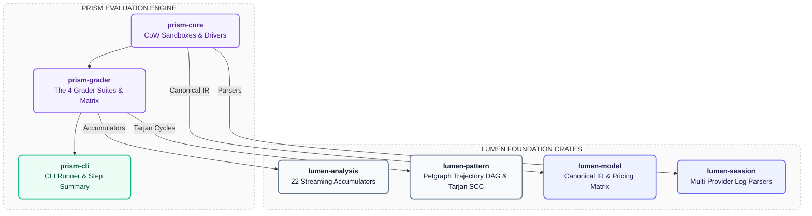
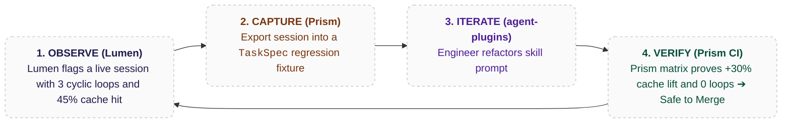

# Lumen Integration & The Closed-Loop Developer Flywheel (`docs/05`)

This document defines the architectural integration between Lumen (observation engine) and Prism (evaluation engine).

---

## 1. Zero Code Duplication (Prism Consumes Lumen Primitives)

Prism does not reinvent token pricing, log parsing, or graph loop algorithms. It directly imports Lumen's core domain crates:

---

## 2. The Closed-Loop Self-Improving Flywheel

Together, Lumen and Prism create a continuous feedback loop:

