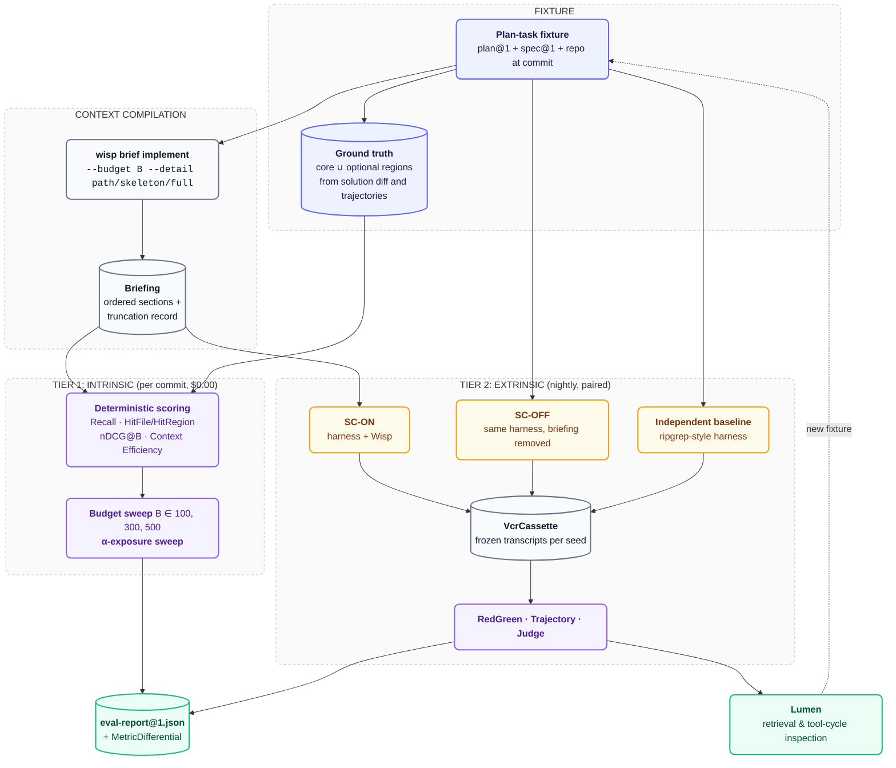

# Evaluating Wisp Briefings (`06-wisp-briefing-evaluation.md`)

This document defines how Prism evaluates whether a [Wisp](https://github.com/orin-axi/wisp) briefing helps an agent. Wisp compiles a bounded, provenance-carrying context document — governing artifacts, acceptance criteria, architecture invariants, code evidence, Git delta, gaps, and an itemized truncation record — and hands it to a coding agent before it starts work. The claim under test is that this document raises correctness and lowers cost relative to the same agent without it.

Prism is the gate on that claim. Wisp's `docs/03-delivery-plan.md` makes the intrinsic tier a hard Milestone 3 acceptance gate: no release without the numbers. Wisp's decision D-020 fixes the two-tier shape and restricts the defensible claim to within-harness comparison.

---

## 1. The Two Tiers

| Tier | Question it answers | Method | Model run | Cost & cadence | Prism surface |
| :--- | :--- | :--- | :---: | :--- | :--- |
| **Intrinsic** | Did the emitted briefing contain the code the solution actually needed, in a good order, without padding? | Deterministic scoring of the briefing text against ground-truth regions, across a budget sweep | No | $0.00, seconds — every commit | `prism test --offline --github-summary` |
| **Extrinsic** | Does the briefing change what the agent achieves? | Paired harness runs, same model, with and without Wisp, $\ge 3$ seeds | Yes | Dollars per cell — nightly and pre-release | `prism matrix run` |

The intrinsic tier is the one that runs constantly. It scores an artifact Wisp already emits, so it needs no agent, no sandbox, and no API spend, and it fails a PR in the same second a selection-policy regression lands. The extrinsic tier is the expensive confirmation: it is the only tier that can say the briefing changed an outcome, and it is priced accordingly.

Neither tier subsumes the other. A briefing can score well intrinsically and change nothing extrinsically — that is the outcome Wisp's own research anticipates for a workload whose files are already declared by the plan. A briefing can also improve resolve rate while scoring poorly on ranking, which would mean the win came from something other than the ordering Wisp's selection policy claims.

---

## 2. Pipeline



---

## 3. Ground Truth

The intrinsic tier needs a per-task answer key: the set of code lines a successful solution had to see. Prism adopts SWE-Explore's construction (arXiv 2606.07297, 848 issues, 203 repos, 10 languages), which distills that key from independent successful trajectories rather than from the diff alone — the regions those trajectories actually consulted, not merely the regions they edited.

| Element | Definition | Source for Wisp's task suite |
| :--- | :--- | :--- |
| $Y$ | The union of ground-truth lines for an issue | Lines the reference solution changed, plus lines consulted by independent successful runs |
| $L(R_{\text{core}})$ | Regions without which the task is not solvable | Distilled per issue by intersection across successful trajectories |
| $L(R_{\text{opt}})$ | Regions that helped but were not required | Consulted by some but not all successful trajectories |
| $L(P)$ | Lines the briefing actually made visible | Parsed from the emitted `Briefing`, per code-evidence item, at its declared detail level |

Wisp's fixtures are plan-task fixtures, not raw issues: a repository at a known commit, a persisted `spec@1` and `plan@1`, one task, and the commit that implemented it. The changed lines of that commit give $Y$ directly and cheaply. Core-versus-optional partitioning still requires the trajectory pass, so the frozen task set is built once, by running several independent successful agents per task and recording which regions each consulted.

**The honest limitation.** Wisp's target workload is not SWE-bench's. A plan task declares its files; a GitHub issue does not. If a task names `src/retry/policy.rs` and the criteria name the symbols, then localization — the thing SWE-Explore measures — is substantially pre-solved by the plan, and a high recall score reflects the plan's quality more than Wisp's selection policy. SuperCoder's authors leave exactly this generalization question open, stating that the deployment decision "hinges not on computational expense but on workload characteristics," specifically whether tasks involve multi-file changes where structural ranking helps. Wisp's workload may be more structurally determined than SWE-bench issues, which would flatter Wisp. Two mitigations, both required:

1. Report intrinsic metrics **split by task type** — tasks whose plan declares every touched file, versus tasks whose solution touched files the plan did not name. The second class is where selection is doing work.
2. Include a **declared-files-only control arm** in the intrinsic tier: score a briefing built from the plan's declared files with no ranking, no closure, no Git evidence. If Wisp does not beat that control, the selection policy is not earning its complexity on this workload.

---

## 4. Intrinsic Metrics

All four metrics are computed per task, per budget $B$, over the emitted briefing. All are deterministic: the same briefing bytes against the same answer key produce the same number on every machine.

| Metric | Formula | What it catches | Why it is in the set |
| :--- | :--- | :--- | :--- |
| **Line Recall** | $\dfrac{\lvert L(P) \cap Y \rvert}{\lvert Y \rvert}$ | Missing core evidence | SWE-Explore names missing core evidence the dominant failure mode, over redundant context |
| **Line Precision** | $\dfrac{\lvert L(P) \cap Y \rvert}{\lvert L(P) \rvert}$ | Dilution from unranked bulk | Reported alongside recall so a whole-file dump cannot pass as selection |
| **HitFile / HitRegion** | Fraction of tasks where $\ge 1$ ground-truth file / region is hit | Gross localization failure | File-level is the number the field already solved; it is reported as a floor, never as the headline |
| **nDCG@B** | $\text{DCG} = \sum_i \dfrac{g_i}{\log_2(i+2)}$, with $g_i = \lvert$core lines region $i$ covers$\rvert$, regions in **emitted order**, normalized against the ideal ordering under the same budget | Good evidence buried behind bad evidence | This is the only metric that scores Wisp's *ordering* claim — the thing the selection policy asserts and section-order policy assumes |
| **Context Efficiency** | $\dfrac{\lvert L(P) \cap (L(R_{\text{core}}) \cup L(R_{\text{opt}})) \rvert}{\lvert L(P) \rvert}$ | Padding to the budget | The counterweight to a recall-first budget policy; falls whenever Wisp spends budget it did not need |

**Report line-level and file-level separately, always.** File-level localization is effectively solved: general agents reach roughly 0.64–0.67 file hits against an oracle's 1.00. Line-level is where they sit at **0.15–0.19 recall**. A file-level number will look excellent and mean nothing, and a briefing that reports files without lines has not moved the metric that matters. CoSIL reaches 0.788 line recall, but only by emitting whole files — which is why Context Efficiency is scored in the same table and not as an afterthought.

### 4.1 Budget Sweep

Every metric is reported at $B \in \{100, 300, 500\}$ lines, or the token equivalent under Wisp's `--budget` flag, with 500 as the primary. One budget is not a result. Wisp's budget policy uses a global cap with per-category reserved floors, spillover, atomic evidence groups, and a relevance floor (D-018); the sweep is what shows whether the floors are helping or whether they are starving a category that a flat ranking would have served.

The sweep also feeds Wisp's Milestone 3 gate directly: `docs/03-delivery-plan.md` requires line recall, nDCG@budget, and context efficiency at all three budgets before release.

### 4.2 α-Exposure Sweep

A separate experiment, and the one that sets Wisp's default budget instead of guessing it. Vary $\alpha$, the fraction of ground-truth evidence included in the briefing, from 0 to 1, and measure resolve rate at each level. SWE-Explore reports that resolve rates **jump between $\alpha = 50\%$ and $\alpha = 75\%$** — evidence pieces must be jointly visible to be useful, which is the finding that motivates atomic evidence groups in the first place.

Two things follow. First, Wisp's default budget should be the smallest budget that reliably clears the jump on its own task suite, measured rather than assumed. Second, the α-exposure sweep is the one intrinsic-tier experiment that requires model runs, because resolve rate is its dependent variable. It is run once per task-suite revision, not per commit, and it is the bridge between the two tiers.

---

## 5. Extrinsic Design

The extrinsic arm design is copied from "Code Isn't Memory: A Structural Codebase Index Inside a Coding Agent" (arXiv 2606.22417), which ran the same experiment for a structural index and published both the wins and the nulls.

| Design rule | Specification | Source result |
| :--- | :--- | :--- |
| **Hold the model constant** | One model across all arms; the arm varies context, never capability | Claude Opus 4.7 across all three arms |
| **Within-harness ablation** | SC-ON (Wisp briefing supplied) vs SC-OFF (identical harness, briefing removed) | Resolve 50.4% vs 41.9%, $+7.9$pp, $p = 0.003$; localization acc@5 84.5% vs 44.3%, $+39.6$pp, $p < 0.0001$ |
| **One independent baseline harness** | A third arm with a different harness entirely, as a sanity comparator — not as the claim | OpenCode ripgrep comparator, 91 instances across Go/Java/Python |
| **$\ge 3$ seeds per cell** | Variance is reported, not hidden | 3 seeds |
| **Per-cell wall-clock cap** | Every cell terminates; no arm wins by running longer | 30-minute per-cell cap |
| **Report p-values** | Every headline delta carries one, including the nulls | See above and below |
| **Headline cost per *solved* task, show cost per run** | The per-run difference is usually null; the per-solve difference is the economic claim | **$2.30 vs $2.84 per solve**, while $/cell is null at $1.15 vs $1.19, $p = 0.73$ |

**State plainly what is and is not defensible.** In the source study the within-harness ablation was significant and the cross-harness comparison was not: 50.4 vs 45.3 resolve at $p = 0.087$, and 84.5 vs 75.3 localization at $p = 0.080$. That is *no regression against an independent harness*, not a proven win over it. Prism reports the cross-harness arm with the same honesty. Wisp's D-020 already commits to this: within-harness is the claim; cross-harness wins are not.

### 5.1 Extrinsic Metrics

The extrinsic tier reuses Prism's existing dimensions rather than defining new ones. Resolve rate comes from Dimension 1 (Pass Rate); token volumes from Dimension 7; financial cost from Dimension 3; turns from Dimension 4; wall time from Dimension 6. Cost per solved task is derived as total arm spend divided by tasks passed, and is the figure that goes in the headline.

---

## 6. Named Experiments

These are open questions, not settled defaults. Each is an arm pair Wisp has committed to running, and each exists because the design decision behind it currently rests on inference or on product precedent rather than measurement.

| Experiment | Arms | Metric | Why it is open |
| :--- | :--- | :--- | :--- |
| **Section ordering** | Governing-first (default) vs reverse (bulk evidence first, governing artifacts last) | nDCG@B intrinsically; resolve rate and tokens extrinsically | Position sensitivity does not reproduce cleanly on current models — Liu et al. report the U-curve, a 2026 reproduction found accuracy "comparatively flat across positions" on AmbigQA, and reverse ranking *helped* multi-hop at larger context sizes. No study tests position sensitivity for a headed, structured document, which is what a briefing is. The default ordering is a prior, not a result |
| **MCP tool count** | 1 tool (mode enum) vs 3 tools (`wisp_brief`, `wisp_artifacts`, `wisp_check`) | Tool-selection accuracy, turns, resolve rate | No ablation exists below roughly 30 tools; published work measures large catalogs. D-019 rests on product precedent — Sourcegraph curating a default of eight — not on a measurement in the one-to-three range Wisp occupies |
| **Route-count ranking** | Ranking with `Evidence::routes > 1` promoted vs ranking ignoring route count | Line recall, nDCG@B | Q-013 states the hypothesis outright: multi-route support correlating with usefulness is cheap to carry and untested. The intrinsic tier can settle it for the price of one extra scoring run |
| **Budget shape** | Global cap with per-category reserved floors and spillover vs a single flat ranking to the same cap | Line recall split by section, Context Efficiency | D-018 is an inference from SWE-Explore's starvation-beats-noise finding, not a direct ablation. No source compares one-budget against per-section budgets |
| **Truncation-marker phrasing** | Itemized per-category counts plus expansion command vs a bare marker vs silent omission | Resolve rate, follow-up tool calls | JetBrains showed masking with a placeholder gives $+2.6\%$ solve rate and 52% lower cost against unmanaged context (Qwen3-Coder 480B), while LLM summarization saved comparably but lengthened trajectories $\sim 15\%$. Nobody compared marker *formats*, and nobody isolated marker-present against content-silently-dropped. AbsenceBench establishes models cannot infer the gap — Claude-3.7-Sonnet reaches only 69.6% F1 at a 5K-token average context — but not what a good gap notice looks like |
| **Hop depth** | 1-hop closure (default) vs 2-hop with fan-out cap and skeleton rendering | Line recall, Context Efficiency, tokens | RepoGraph's k-ablation is the only direct evidence and it is one system on 300 instances with 2–3pp gaps |

---

## 7. Reference Points

Absolute numbers from the literature, for sanity-checking Prism's own cost and token figures. These are not targets; the benchmarks and budgets differ and do not compose into a ranking.

| System | Cost | Tokens | Accuracy | Benchmark |
| :--- | :--- | :--- | :--- | :--- |
| **Agentless** | $0.70 per issue | 78,166 per issue | 32.00% (96/300) | SWE-bench Lite |
| **LocAgent** | $0.09 (fine-tuned Qwen-32B) – $0.66 (Claude-3.5) per example | — | 77.74 File Acc@5 | SWE-Bench-Lite localization |
| **Nemotron-CORTEXA** | $3.28 per problem | — | 68.2% | SWE-bench Verified |
| **SuperCoder** (structural index) | **$2.30 per solve** ($2.84 without) | — | 50.4% resolve | 91 instances, Go/Java/Python |
| **RepoGraph** 1-hop flattened | — | — | **29.67%** | SWE-bench Lite (Agentless) |
| **RepoGraph** 2-hop flattened | — | — | **26.00%** | SWE-bench Lite (Agentless) |
| **RepoGraph** no-graph baseline | — | — | 27.33% | SWE-bench Lite (Agentless) |

The RepoGraph rows are the reason Wisp's default closure is one hop: two hops of raw expansion measures *below the no-graph baseline*, and only recovers to roughly 1-hop level once summarized (28.67%), never beating it. If Prism's hop-depth experiment reproduces that ordering on Wisp's task suite, the default stands; if it does not, D-018's one-hop default is the thing to revisit.

---

## 8. The Reading Rule

**A smaller briefing is an improvement only if correctness holds.** This is the rule from Wisp's `docs/03-delivery-plan.md` and it governs every table above. A token reduction with a resolve-rate drop is a regression reported as a win, and Prism's differential must never present it as one. The gate is: Pass Rate holds or improves, *then* cost and token deltas are read.

The corollary applies to the intrinsic tier. Context Efficiency rising while Line Recall falls is a briefing that got tidier and less useful. The two are always read as a pair, never separately.

**Lumen closes the loop.** Lumen inspects the extrinsic tier's trajectories for the behavior a good briefing should eliminate: repeated retrieval of material the briefing already contained, circular tool loops, and context growth from re-reading files. `lumen-pattern`'s Tarjan SCC cycle detector and the `trajectory_dag`, `tool_inventory`, and `context_growth` accumulators supply those signals. When Lumen flags a session where the agent re-searched for something the briefing had emitted, that session becomes a new `TaskSpec` regression fixture — the capture step of the flywheel in [`05-lumen-integration-and-closed-loop-flywheel.md`](./05-lumen-integration-and-closed-loop-flywheel.md). The intrinsic tier then has a new task whose ground truth is known to be a selection failure, and the loop closes.

---

## 9. Mapping onto Prism Machinery

Neither tier introduces a parallel evaluation stack. Both are expressed with the components already defined in [`01`](./01-core-evaluation-and-vcr-cassettes.md), [`02`](./02-the-four-grader-engines.md), and [`04`](./04-multi-dimensional-matrix-and-differentials.md).

### 9.1 Graders

| Tier | Grader engine | Role |
| :--- | :--- | :--- |
| Intrinsic | **`RedGreenGrader`** family (`deterministic.rs`) | Line Recall, HitFile/HitRegion, nDCG@B, and Context Efficiency are deterministic comparisons of an emitted artifact against a fixture answer key — the same class of assertion as Red-to-Green state transition and AST signature grounding, and they belong beside them rather than in a new engine |
| Extrinsic | **`RedGreenGrader`** | Resolve rate per arm: the fixture's failing test must go red-to-green with zero regressions |
| Extrinsic | **`TrajectoryGrader`** | Token volumes, prompt cache hit ratio, and zero circular exploration loops per arm. A briefing that stabilizes the prompt prefix should raise cache hit ratio; a briefing that supplies the right evidence should reduce cycles |
| Extrinsic | **`CalibratedJudge`** | Optional, for tasks whose acceptance criteria are qualitative and not expressible as a test transition |
| Neither | **`CircuitBreakerGrader`** | Not applicable. Wisp's evaluation is single-agent; there is no Drafter–Auditor handoff to bound. Recorded here so its absence is not read as an oversight |

Two Prism-side items this document does not settle, flagged rather than assumed:

- The `Grader` trait is `evaluate(&TaskSpec, &CanonicalTranscript)`. The intrinsic tier scores a `Briefing`, not a model transcript. Carrying the briefing as a single-turn transcript from a `wisp brief` invocation fits the existing signature and keeps the offline path unchanged, but whether that is the right carrier — or whether the intrinsic tier warrants a distinct grader input — is a Prism decision.
- Ground-truth regions ($Y$, core, optional) are per-task fixture data with no home in `TaskSpec` today. They belong alongside `expected_assertions` and `fixture_repo`.

### 9.2 Matrix

Arms, seeds, and budgets are the Cartesian product of `[[matrix.configs]]` entries in `prism.matrix.toml`. One config per cell:

```toml
[matrix]
name = "wisp-briefing-m3-gate"
tasks = "suites/wisp-plan-tasks.json"

[[matrix.configs]]
id = "sc-off-baseline"
model = "claude-opus-4-7"
harness = "claude-cli"
prompt_setup = "prompts/no-briefing.md"

[[matrix.configs]]
id = "sc-on-b500"
model = "claude-opus-4-7"
harness = "claude-cli"
skill = "wisp-brief"

[[matrix.configs]]
id = "opencode-independent"
model = "claude-opus-4-7"
harness = "opencode"
```

`MetricDifferential` produces the deltas against the designated baseline config — `delta_pass_rate_pct`, `delta_cost_pct`, `delta_turns_pct`, `delta_cache_hit_pct`, `delta_wall_time_pct`. Three gaps between that struct and what the extrinsic design requires, flagged for the implementing spec: it carries no seed dimension, no p-value, and no cost-per-solved-task field. All three are required outputs of Section 5 and none is expressible today.

### 9.3 Cassettes

`prism record --task=<TASK>` freezes each live paired run into a `VcrCassette { task_id, prompt_hash, transcript }`. Because the Wisp briefing changes the prompt bytes, `prompt_hash` distinguishes an SC-ON cell from an SC-OFF cell for free — the arms cannot be silently confused at replay time.

What this buys: the extrinsic tier's *graders* re-run on every PR through `VcrReplayDriver` at under a millisecond and $0.00, so a change to a grader threshold, a scoring formula, or the differential math is regression-tested against real frozen trajectories without re-spending on model runs. The live paired runs stay on the nightly `eval-nightly.yml` schedule.

What it does not buy: a cassette freezes one sample. New seeds, new models, and new task-suite revisions require new live runs. Cassettes make the extrinsic tier **replayable**, not **re-measurable**.

The intrinsic tier needs no cassettes at all — it consumes the emitted briefing directly and runs in the existing offline PR gate (`eval-pr.yml`, under 10 seconds, $0.00 API spend).

---

## 10. Gate Summary

| Gate | Tier | Condition | Cadence |
| :--- | :--- | :--- | :--- |
| Wisp M3 release gate | Intrinsic | Line recall, nDCG@budget, and Context Efficiency reported at $B \in \{100, 300, 500\}$; α-exposure sweep used to set the default budget | Blocks the milestone |
| Selection-policy regression | Intrinsic | No drop in Line Recall or nDCG@B against the previous commit at any budget | Every PR |
| Padding regression | Intrinsic | Context Efficiency does not fall while Line Recall is flat | Every PR |
| Correctness-first | Extrinsic | Pass Rate holds or improves before any cost or token delta is read as a win | Nightly |
| Economic claim | Extrinsic | Cost per solved task reported as the headline, cost per run shown alongside with its p-value | Pre-release |
